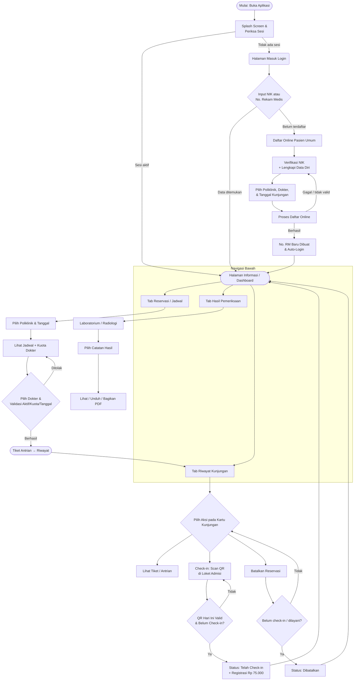

# RANCANG BANGUN APLIKASI MOBILE PASIEN **"RSUD MOBILE"**

## Sebagai Media Pelayanan Registrasi Online, Informasi Jadwal Dokter, Hasil Pemeriksaan, dan Manajemen Antrian yang Terintegrasi dengan SIMRS

---

**KARYA ILMIAH**

*Disusun sebagai laporan pengembangan sistem informasi pelayanan kesehatan RSUD Malangbong*

---

**Nama Penyusun  : ..........................................................**

**NIM / NIP       : ..........................................................**

**Instansi / Unit : RSUD Malangbong**

**RSUD MALANGBONG – 2026**

<div style="page-break-after: always;"></div>

---

# LEMBAR PENGESAHAN

Karya ilmiah yang berjudul **"Rancang Bangun Aplikasi Mobile Pasien 'RSUD Mobile' sebagai Media Pelayanan Registrasi Online, Informasi Jadwal Dokter, Hasil Pemeriksaan, dan Manajemen Antrian yang Terintegrasi dengan SIMRS"** telah disetujui dan disahkan sebagai laporan pengembangan sistem informasi pelayanan kesehatan.

<table>
<tr><td style="width:60%"> </td><td style="width:40%">Garut, ........................................ 2026</td></tr>
<tr><td>Mengetahui,<br/><br/>Direktur RSUD Malangbong</td><td>Menyetujui,<br/><br/>Pembimbing / Penanggung Jawab</td></tr>
<tr><td><br/><br/><br/>( .......................................................... )<br/>NIP. ..............................</td><td><br/><br/><br/>( .......................................................... )<br/>NIP. ..............................</td></tr>
</table>

<div style="page-break-after: always;"></div>

---

# ABSTRAK

Rumah Sakit Umum Daerah (RSUD) Malangbong masih menghadapi permasalahan pelayanan pada proses registrasi kunjungan, penyediaan informasi jadwal dokter yang mutakhir, penyerahan hasil laboratorium dan radiologi, serta pengelolaan antrian pasien rawat jalan. Penelitian ini bertujuan merancang dan membangun **RSUD Mobile**, aplikasi *mobile* pasien berbasis *web application* yang dikemas dengan **Capacitor** sehingga berjalan pada perangkat Android maupun peramban (*browser*). Aplikasi menerapkan arsitektur klien–server: klien dibangun dengan **React + Vite**, sedangkan server memakai bahasa **PHP** dan basis data **PostgreSQL** yang terhubung langsung ke *Sistem Informasi Manajemen Rumah Sakit* (SIMRS) rumah sakit melalui antarmuka *Application Programming Interface* (API).

Fitur yang diimplementasikan meliputi masuk pengguna berbasis NIK atau Nomor Rekam Medis (RM), pendaftaran *online* pasien umum baru dengan verifikasi NIK, pencarian dan reservasi jadwal dokter berkuota, penelusuran serta unduhan hasil laboratorium dan radiologi dalam format PDF, penelusuran riwayat kunjungan dan tiket antrian, *check-in* berbasis kode QR di loket admisi, hingga pembatalan reservasi. Pengujian fungsional menunjukkan seluruh alur berjalan sesuai rancangan; sistem mencegah reservasi ganda dan tanggal mundur, mengendalikan kuota dokter, memakai *advisory lock* pada penomoran antrian, serta menyegarkan data secara otomatis. Aplikasi diharapkan memangkas waktu antrean, menaikkan transparansi layanan, dan menurunkan beban kerja loket administrasi.

**Kata kunci:** *aplikasi mobile, registrasi online, reservasi dokter, hasil pemeriksaan, QR check-in, SIMRS, RSUD Malangbong*

<div style="page-break-after: always;"></div>

---

# DAFTAR ISI

| No | Judul | Hal. |
|---|---|---|
| | **BAGIAN AWAL** | |
| | Halaman Judul / Sampul | i |
| | Lembar Pengesahan | ii |
| | Abstrak | iii |
| | Daftar Isi | iv |
| | Daftar Tabel | v |
| | Daftar Gambar | v |
| | Kata Pengantar | vi |
| | **BAB I — PENDAHULUAN** | |
| 1.1 | Latar Belakang Masalah | 1 |
| 1.2 | Identifikasi Masalah | 2 |
| 1.3 | Rumusan Masalah | 2 |
| 1.4 | Tujuan Penelitian | 3 |
| 1.5 | Manfaat Penelitian | 3 |
| 1.6 | Ruang Lingkup dan Batasan | 3 |
| | **BAB II — TINJAUAN PUSTAKA** | |
| 2.1 | Landasan Teori | 4 |
| 2.2 | Kerangka Pemikiran | 6 |
| 2.3 | Penelitian Terdahulu | 7 |
| | **BAB III — METODE PENELITIAN** | |
| 3.1 | Metode dan Kerangka Kerja | 7 |
| 3.2 | Analisis Kebutuhan Sistem | 8 |
| 3.3 | Kebutuhan Perangkat | 9 |
| 3.4 | Rancangan Arsitektur Sistem | 9 |
| 3.5 | Rancangan API dan Basis Data | 10 |
| | **BAB IV — HASIL DAN PEMBAHASAN** | |
| 4.1 | Implementasi Aplikasi | 11 |
| 4.2 | Implementasi Teknis Kunci | 12 |
| 4.3 | Pengujian Sistem | 13 |
| 4.4 | Pembahasan | 14 |
| | **BAB V — PENUTUP** | |
| 5.1 | Kesimpulan | 15 |
| 5.2 | Saran | 15 |
| | **DAFTAR PUSTAKA** | 16 |
| | **LAMPIRAN** | |
| Lampiran A | Panduan Penggunaan Aplikasi (2 halaman) | A-1 |
| Lampiran B | Alur (Flowchart) Aplikasi (1 halaman F4) | B-1 |

> **Catatan:** Nomor halaman pada tabel di atas bersifat indikatif dan akan mengikuti tata-letak saat dokumen dikonversi ke *Microsoft Word / Google Docs / PDF*.

---

# DAFTAR TABEL

| No | Judul Tabel | Hal. |
|---|---|---|
| 3.1 | Definisi Aktor Sistem | 8 |
| 3.2 | Kebutuhan Fungsional | 8 |
| 3.3 | Kebutuhan Non-Fungsional | 9 |
| 3.4 | Daftar Layanan (Action) API | 10 |
| 4.1 | Pemetaan Modul & Fitur Aplikasi | 11 |
| 4.2 | Hasil Pengujian Fungsional (Black-box) | 13 |

---

# DAFTAR GAMBAR

| No | Judul Gambar | Hal. |
|---|---|---|
| 2.1 | Kerangka Pemikiran | 6 |
| 3.1 | Arsitektur Klien–Server Tiga Lapis | 9 |
| 4.1 | Alur *Check-in* Kode QR | 12 |
| B.1 | Bagan Alur (Flowchart) Utama Aplikasi | B-1 |

<div style="page-break-after: always;"></div>

---

# KATA PENGANTAR

Puji syukur penulis panjatkan ke hadirat Tuhan Yang Maha Esa karena atas rahmat-Nya karya ilmiah yang berjudul **"Rancang Bangun Aplikasi Mobile Pasien 'RSUD Mobile'"** dapat diselesaikan dengan baik. Karya ilmiah ini disusun sebagai pertanggungjawaban teknis pengembangan aplikasi layanan pasien di RSUD Malangbong sekaligus sebagai sarana sosialisasi fitur dan alur pemakaian kepada pengguna.

Laporan ini memuat latar belakang, landasan teori, metode pengembangan, hasil implementasi beserta pengujian, kesimpulan, dan saran. Dokumen dilengkapi pula dengan **panduan penggunaan** (Lampiran A) dan **diagram alur aplikasi** (Lampiran B) agar seluruh pemangku kepentingan — pasien, petugas loket, dan manajemen rumah sakit — memahami cara kerja sistem secara utuh.

Penulis mengucapkan terima kasih kepada Direksi RSUD Malangbong, jajaran manajemen, rekan-rekan di unit SIMRS dan pelayanan, serta semua pihak yang telah membantu. Kritik dan saran yang membangun sangat penulis harapkan demi penyempurnaan aplikasi dan laporan ini.

<div style="text-align:right">
<br/>
Garut, ................ 2026<br/>
<br/>
Penulis,
<br/><br/><br/>
( .......................................................... )
</div>

<div style="page-break-after: always;"></div>

---

# BAB I — PENDAHULUAN

## 1.1 Latar Belakang Masalah

Perkembangan teknologi informasi telah mengubah ekspektasi masyarakat terhadap pelayanan kesehatan. Pasien tidak lagi sekadar menuntut mutu medis, tetapi juga kemudahan, kecepatan, keterbukaan informasi, dan kemampuan mengakses layanan tanpa harus hadir secara fisik. Di sisi lain, rumah sakit dituntut untuk menjaga akurasi data, efisiensi operasional, dan kepuasan pasien dalam jumlah kunjungan yang terus meningkat.

RSUD Malangbong sebagai rumah sakit umum daerah menyelenggarakan pelayanan kesehatan yang melayani masyarakat dengan cakupan luas. Berdasarkan observasi pada alur pelayanan, ditemukan sejumlah kendala yang berulang, yaitu:

1. **Registrasi manual:** pasien rawat jalan harus mengantre di loket pendaftaran untuk setiap kunjungan, sehingga memakan waktu pada jam sibuk.
2. **Informasi jadwal tidak mutakhir:** pasien kerap datang namun dokter tidak praktik, atau sebaliknya kehilangan kesempatan karena tidak mengetahui jadwal terbaru.
3. **Penyerahan hasil lambat:** hasil laboratorium dan radiologi hanya dapat diperoleh dengan mengambil langsung di rumah sakit pada waktu tertentu.
4. **Kurangnya transparansi status:** pasien tidak dapat memantau status kunjungan, nomor antrian, maupun riwayat kunjungan secara mandiri.
5. **Risiko duplikasi data:** pendaftaran manual berulang memungkinkan kesalahan penulisan identitas dan pembuatan rekam medis ganda.

Berdasarkan permasalahan tersebut, RSUD Malangbong mengembangkan **aplikasi mobile pasien** yang diberi nama **RSUD Mobile**. Aplikasi ini dirancang sebagai kanal pelayanan mandiri (*self-service*) yang terhubung langsung dengan SIMRS rumah sakit sehingga data pasien, jadwal dokter, dan hasil pemeriksaan selalu sinkron dan real-time. Kehadiran aplikasi ini diharapkan menjadi jawaban atas kebutuhan digitalisasi layanan yang cepat, transparan, dan dapat diakses di mana saja.

## 1.2 Identifikasi Masalah

Berdasarkan latar belakang, masalah yang teridentifikasi adalah:

1. Alur pendaftaran dan pencarian jadwal masih bersifat manual serta belum tersedia bagi pasien secara daring.
2. Belum tersedia kanal bagi pasien untuk mengakses hasil laboratorium/radiologi dan riwayat kunjungan secara mandiri.
3. Belum ada media yang memastikan status kunjungan, nomor antrian, dan validasi *check-in* secara transparan dan aman.
4. Belum terjaminnya pencegahan pendaftaran ganda serta keakuratan penomoran antrian pada pendaftaran bersamaan.

## 1.3 Rumusan Masalah

Rumusan masalah penelitian ini adalah:

1. Bagaimana merancang dan membangun aplikasi *mobile* pasien yang mudah digunakan, terintegrasi dengan SIMRS, dan mencakup layanan registrasi *online*, informasi jadwal, hasil pemeriksaan, serta riwayat kunjungan?
2. Bagaimana merancang alur penggunaan mulai dari masuk pengguna, pendaftaran pasien baru, reservasi dokter, hingga *check-in* kunjungan?
3. Bagaimana memastikan keandalan sistem dari aspek pencegahan pendaftaran ganda, pengelolaan kuota dokter, validasi *check-in*, serta pembaruan data secara otomatis?
4. Bagaimana menguji sistem dan menyusun dokumentasi berupa panduan penggunaan serta diagram alur?

## 1.4 Tujuan Penelitian

1. Merancang dan membangun aplikasi *mobile* pasien **RSUD Mobile** berbasis web + Android (Capacitor) yang terintegrasi dengan SIMRS RSUD Malangbong.
2. Mengimplementasikan fitur masuk pengguna, pendaftaran *online*, reservasi jadwal dokter, hasil laboratorium/radiologi, riwayat dan tiket, serta *check-in* kode QR.
3. Menerapkan mekanisme pengendalian duplikasi pendaftaran, kuota dokter, validasi tanggal, dan keamanan transaksi.
4. Menguji fungsionalitas sistem serta menyusun panduan penggunaan dan diagram alur aplikasi.

## 1.5 Manfaat Penelitian

1. **Bagi pasien:** pendaftaran dan reservasi tanpa antrean panjang, informasi jadwal dokter yang akurat, serta akses hasil pemeriksaan dan riwayat kunjungan secara mandiri.
2. **Bagi RSUD Malangbong:** mengurangi beban loket administrasi, mempercepat alur pelayanan, meningkatkan akurasi data, serta menaikkan citra layanan berbasis teknologi.
3. **Bagi pengembang/peneliti lain:** menjadi rujukan penerapan aplikasi *mobile* hibrida dan integrasi API pada layanan kesehatan.

## 1.6 Ruang Lingkup dan Batasan

Ruang lingkup meliputi pengembangan sisi *front-end*, perancangan API, integrasi basis data, pengujian fungsional, serta penyusunan dokumentasi. Batasan penelitian:

1. Pengguna sasaran adalah pasien rawat jalan terdaftar dan calon pasien umum baru RSUD Malangbong.
2. Autentikasi menggunakan NIK atau Nomor Rekam Medis tanpa kata sandi/OTP pada versi berjalan (penguatan keamanan menjadi saran pengembangan).
3. Format tabel jadwal dokter mengikuti struktur SIMRS yang dideteksi secara adaptif pada server rumah sakit.
4. Lingkup pengujian menekankan aspek fungsional, bukan pengukuran beban (*performance*) skala besar.

<div style="page-break-after: always;"></div>

---

# BAB II — TINJAUAN PUSTAKA

## 2.1 Landasan Teori

### 2.1.1 Sistem Informasi Manajemen Rumah Sakit (SIMRS)
Berdasarkan Permenkes No. 82 Tahun 2013, SIMRS merupakan suatu sistem teknologi informasi yang memproses dan mengintegrasikan seluruh alur proses pelayanan rumah sakit dalam bentuk jaringan koordinasi, pelaporan, dan prosedur administrasi. SIMRS menyimpan data pasien, kunjungan (*registrasi*), penjadwalan, serta hasil pemeriksaan penunjang. Aplikasi RSUD Mobile berfungsi sebagai kanal presentasi yang membaca dan menulis data SIMRS melalui API tanpa mengubah struktur basis data inti.

### 2.1.2 Aplikasi Mobile Hibrida dan Capacitor
Aplikasi *mobile* dapat dibangun secara *native*, *hybrid*, atau berbasis *web*. Pendekatan *hybrid* memungkinkan satu basis kode berjalan lintas platform. **Capacitor** adalah *runtime* resmi dari proyek Ionic yang membungkus aplikasi web menjadi aplikasi *native* (dalam hal ini Android) serta menyediakan akses ke kemampuan perangkat melalui *plugin* seperti `Filesystem`, `Share`, `Browser`, dan `SplashScreen`. Keunggulannya adalah pengembangan cepat, satu kode untuk web dan Android, serta kemampuan memperbarui fitur tanpa sepenuhnya membangun ulang APK (perbaikan sisi server langsung dirasakan aplikasi yang telah terpasang).

### 2.1.3 React dan Vite
**React** adalah pustaka JavaScript untuk membangun antarmuka pengguna berbasis komponen. **Vite** adalah *build tool* yang menyediakan *development server* cepat dan pengemasan berkas untuk produksi. Antarmuka RSUD Mobile dibangun dengan komponen-komponen React yang saling berinteraksi (misalnya `App`, `BottomNav`, `Login`, dan berbagai modul `Tab*`), dengan gaya tampilan mengikuti pedoman Material Design 3 menggunakan **Tailwind CSS**, dan dialog/konfirmasi memakai **SweetAlert2**.

### 2.1.4 REST API dan Pertukaran Data JSON
Komunikasi klien–server memakai pola **REST**. Seluruh aksi dipetakan pada satu *endpoint* `api.php` dengan parameter `action`. Data dikirim/diterima dalam format **JSON** melalui metode `GET` dan `POST`. Sesi dijaga dengan *cookie* HTTP-only. Arsitektur ini membuat pemisahan yang jelas antara antarmuka dan logika data sehingga integrasi lintas platform menjadi mudah.

### 2.1.5 Basis Data Relasional dan PostgreSQL
SIMRS RSUD Malangbong dibangun di atas **PostgreSQL**. Data yang digunakan aplikasi meliputi tabel pasien, ruangan/poliklinik, jadwal dokter, penjadwalan kunjungan, antrian, serta hasil pemeriksaan. Untuk mencegah kondisi perlombaan (*race condition*) ketika banyak pasien mendaftar bersamaan, sistem memakai *advisory lock* dan transaksi saat membuat Nomor RM dan nomor antrian sehingga tidak terjadi duplikasi atau lompatan nomor.

### 2.1.6 Pemindaian Kode QR untuk *Check-in*
Kode QR digunakan sebagai media validasi kehadiran pasien. Loket admisi menampilkan halaman `barcode.php` berisi satu kode QR umum yang memuat nilai `CHECKIN-RSUD-MALANGBONG-<YYYYMMDD>`. Nilai memuat tanggal sehingga kode otomatis berubah setiap hari dan tidak dapat dipakai ulang di hari lain. Pasien memindai kode ini dari menu Riwayat → *Check-in*; sistem memvalidasi format kode, memastikan kunjungan aktif dan belum *check-in*, kemudian menandai status dan menambahkan tindakan registrasi. Pustaka **html5-qrcode** dipakai untuk membuka kamera dan memindai.

## 2.2 Kerangka Pemikiran

Kerangka pemikiran penelitian digambarkan sebagai berikut.

```
┌──────────────────────────────────────────────────────────────────────┐
│  PERMASALAHAN                                                         │
│  Antrean loket, jadwal tidak mutakhir, hasil sulit diakses,           │
│  status kunjungan tidak transparan, risiko duplikasi data             │
└───────────────────────────────────┬──────────────────────────────────┘
                                    ▼
┌──────────────────────────────────────────────────────────────────────┐
│  SOLUSI — APLIKASI RSUD MOBILE                                       │
│  Klien: React + Vite + Capacitor (Android & Web)                     │
│  Server: PHP (api.php) + PostgreSQL (SIMRS)                          │
└───────────────────────────────────┬──────────────────────────────────┘
                                    ▼
┌──────────────────────────────────────────────────────────────────────┐
│  FITUR                                                               │
│  Login NIK/RM • Daftar Online • Reservasi Jadwal • Hasil Lab/Rad     │
│  Riwayat & Tiket • Check-in QR • Batalkan Reservasi                  │
└───────────────────────────────────┬──────────────────────────────────┘
                                    ▼
┌──────────────────────────────────────────────────────────────────────┐
│  KELUARAN (MANFAAT)                                                  │
│  Efisiensi antrean • Transparansi layanan • Akurasi data •           │
│  Dokumentasi (panduan & alur aplikasi)                               │
└──────────────────────────────────────────────────────────────────────┘
```

## 2.3 Penelitian Terdahulu

Banyak pengembangan aplikasi *mobile* kesehatan telah berfokus pada satu layanan, misalnya *booking online* antrian poliklinik atau unduhan hasil laboratorium secara terpisah. Kebaruan (*novelty*) RSUD Mobile adalah penggabungan beberapa layanan dalam satu aplikasi — pendaftaran pasien baru dengan verifikasi NIK, reservasi dokter berkuota, hasil laboratorium dan radiologi PDF, riwayat lengkap dengan tiket antrian, serta *check-in* QR — yang seluruhnya terhubung langsung ke SIMRS aktif rumah sakit dan menyegarkan data secara otomatis (setiap ±5 detik setelah masuk).

<div style="page-break-after: always;"></div>

---

# BAB III — METODE PENELITIAN

## 3.1 Metode dan Kerangka Kerja

Pengembangan sistem dilakukan dengan pendekatan siklik yang menyerupai model air terjun (*waterfall*) pada lingkup kecil, meliputi:

1. **Analisis kebutuhan** — mengidentifikasi kendala layanan dan menetapkan kebutuhan fungsional serta non-fungsional.
2. **Perancangan** — menyusun arsitektur, daftar layanan API, alur sistem, dan kebutuhan perangkat.
3. **Pembangunan** — mengimplementasikan sisi klien (React) dan sisi server (PHP/basis data).
4. **Pengujian** — melakukan uji fungsional dan memperbaiki temuan.
5. **Dokumentasi** — menyusun karya ilmiah, panduan penggunaan, dan diagram alur.

## 3.2 Analisis Kebutuhan Sistem

**a. Aktor sistem** — pihak yang berinteraksi dengan aplikasi disajikan pada Tabel 3.1.

*Tabel 3.1 — Definisi Aktor Sistem*

| Aktor | Peran |
|---|---|
| Pasien (Pengguna) | Melakukan masuk, mendaftar, reservasi, melihat hasil & riwayat, *check-in*, membatalkan reservasi. |
| Petugas Admisi/Loket | Menyediakan kode QR *check-in* (halaman `barcode.php`) dan melayani pasien di rumah sakit. |
| Admin SIMRS | Mengelola data poliklinik, jadwal dokter, dan hasil pemeriksaan pada sistem SIMRS. |
| Sistem Eksternal | Layanan verifikasi NIK (dengan *fallback* lokal) dan layanan cetak PDF hasil SIMRS. |

**b. Kebutuhan fungsional** disajikan pada Tabel 3.2.

*Tabel 3.2 — Kebutuhan Fungsional*

| Kode | Kebutuhan Fungsional |
|---|---|
| F-01 | Sistem menyediakan masuk pengguna menggunakan NIK (16 digit) atau No. Rekam Medis. |
| F-02 | Sistem menampilkan halaman Informasi (pengumuman/panduan) dan kartu profil pasien. |
| F-03 | Sistem menerima pendaftaran pasien umum baru dengan verifikasi NIK dan pembuatan No. RM. |
| F-04 | Sistem menampilkan poliklinik serta jadwal dokter lengkap dengan jam dan sisa kuota. |
| F-05 | Sistem melayani reservasi kunjungan dengan validasi tanggal, kuota, dan status kunjungan aktif. |
| F-06 | Sistem menampilkan serta mengunduh/membagikan hasil laboratorium dan radiologi (PDF). |
| F-07 | Sistem menampilkan riwayat kunjungan, tiket/nomor antrian, dan status kunjungan. |
| F-08 | Sistem melayani *check-in* berbasis pemindaian kode QR. |
| F-09 | Sistem melayani pembatalan reservasi sebelum *check-in*/dilayani. |
| F-10 | Sistem menyediakan keluaran akun dan penanganan kondisi *offline*. |

**c. Kebutuhan non-fungsional** disajikan pada Tabel 3.3.

*Tabel 3.3 — Kebutuhan Non-Fungsional*

| Aspek | Keterangan |
|---|---|
| Keandalan | Pencegahan duplikasi (reservasi ganda, nomor antrian) dengan *advisory lock*; pembaruan data otomatis. |
| Keamanan | Sesijaga *cookie* HTTP-only; *timeout* permintaan 12 detik; batasan akses; ke depan perlu autentikasi berlapis. |
| Kinerja | Permintaan API paralel dan *timeout* untuk menghindari aplikasi menggantung saat jaringan bermasalah. |
| Usabilitas | Antarmuka ala Material Design 3, tema hijau khas rumah sakit, pesan konfirmasi, dan panduan pemakaian. |
| Kompatibilitas | Satu basis kode untuk web (peramban) dan Android (Capacitor). |

## 3.3 Kebutuhan Perangkat

- **Perangkat keras:** telepon pintar Android; komputer server basis data.
- **Perangkat lunak (klien):** aplikasi RSUD Mobile; teknologi React, Vite, Tailwind CSS, SweetAlert2, html5-qrcode; Capacitor 7 beserta plugin App, Browser, Filesystem, Share, SplashScreen.
- **Perangkat lunak (server):** bahasa PHP, PostgreSQL, koneksi HTTPS, serta SIMRS rumah sakit. Kredensial basis data dan parameter dapat dikonfigurasi melalui variabel lingkungan (`RSUD_DB_*`, `RSUD_JADWAL_TABLE`, `RSUD_DIAG_KEY`).

## 3.4 Rancangan Arsitektur Sistem

Sistem menerapkan arsitektur klien–server tiga lapis.

*Gambar 3.1 — Arsitektur Klien–Server Tiga Lapis*
```
┌──────────────────────┐      HTTPS       ┌───────────────────────────┐
│  LAPISAN PRESENTASI  │ ───────────────▶ │  LAPISAN APLIKASI (API)   │
│  RSUD Mobile         │                  │  backend/api.php          │
│  (React + Vite +     │ ◀─────────────── │  JSON + cookie session    │
│   Capacitor)         │     JSON         │  Validasi & transaksi     │
│  Android / Web       │                  └────────────┬──────────────┘
└──────────────────────┘                               │ SQL
                                                        ▼
                              ┌─────────────────────────────────────────┐
                              │  LAPISAN DATA — PostgreSQL (SIMRS)      │
                              │  pasien • ruangan • jadwal • kunjungan  │
                              │  antrian • hasil lab/radiologi          │
                              └─────────────────────────────────────────┘
```

## 3.5 Rancangan API dan Basis Data

Sisi server menyediakan sejumlah layanan yang dipetakan lewat parameter `action` pada `api.php` (Tabel 3.4).

*Tabel 3.4 — Daftar Layanan (Action) API*

| Action | Fungsi | Metode |
|---|---|---|
| `login` / `logout` | Masuk (NIK/No RM) dan keluar akun | POST / GET |
| `get_profile` | Mengambil profil & cek sesi pasien | GET |
| `get_masters` | Data master (poliklinik, wilayah, dsb.) | GET |
| `get_orders` | Order laboratorium & radiologi | GET |
| `get_riwayat` | Riwayat kunjungan + status + dokter | GET |
| `get_poliklinik_list` | Daftar poliklinik | GET |
| `get_jadwal_dokter` | Jadwal dokter + kuota per tanggal/poli | GET |
| `get_dokter_by_jadwal` | Daftar dokter pada jadwal tertentu | GET |
| `check_active_booking` | Cek kunjungan aktif (anti ganda) | GET |
| `get_ticket_detail` | Detail tiket/nomor antrian | GET |
| `checkin` | Proses *check-in* QR | POST |
| `cancel_reservation` | Membatalkan reservasi | POST |
| `search_nik` / `search_desa` | Verifikasi NIK & pencarian wilayah | GET |
| `daftar_online` | Pendaftaran pasien baru / terdaftar | POST |

Aturan bisnis yang ditegakkan di sisi server antara lain: tanggal kunjungan tidak boleh mundur dan maksimal **30 hari** ke depan; tidak boleh ada reservasi baru jika masih ada kunjungan aktif; kuota dokter dihitung dari kuota dikurangi jumlah terpakai; pembatalan hanya untuk kunjungan yang belum *check-in*/pulang; penomoran Nomor RM dan antrian dilindungi *advisory lock*; dan zona waktu server diatur ke **Asia/Jakarta**.

<div style="page-break-after: always;"></div>

---

# BAB IV — HASIL DAN PEMBAHASAN

## 4.1 Implementasi Aplikasi

Aplikasi RSUD Mobile versi 1.x berhasil dibangun dan dikemas sebagai APK Android (`com.rsudmalangbong.mobile`). Pemetaan modul terhadap fitur ditunjukkan pada Tabel 4.1.

*Tabel 4.1 — Pemetaan Modul & Fitur Aplikasi*

| Modul / Komponen | Fitur | Keterangan |
|---|---|---|
| `SplashScreen` | Layar pembuka + cek sesi | Logo RSUD; pesan "Memeriksa sesi Anda...". |
| `Login` | Masuk pengguna | Input NIK 16 digit / No. RM; auto-login saat 16 karakter; menu "Daftar Online" & "Panduan". |
| `TabDaftar` | Pendaftaran pasien baru & terdaftar | Verifikasi NIK eksternal + *fallback* format lokal; pilih poli/dokter/tanggal; auto-login pasien baru. |
| `TabInformasi` | Halaman awal (informasi) | Memuat halaman informasi RSUD; tombol *Coba Lagi*; penanda koneksi *offline*. |
| `TabJadwal` | Reservasi dokter | Pilih poliklinik → tanggal → tampil jadwal, jam, kuota, sisa kuota → reservasi. |
| `TabHasil` (+`TabLab`, `TabRad`) | Hasil pemeriksaan | Sub-menu Laboratorium & Radiologi; tombol unduh/buka PDF. |
| `TabRiwayat` | Riwayat & tindakan | Status kunjungan, tiket, detail; tombol *Check-in* QR dan *Batalkan*. |
| `ProfileCard` / `BottomNav` | Profil & navigasi | Kartu profil + keluar; 4 menu utama: Informasi, Reservasi, Hasil, Riwayat. |

**Perilaku utama aplikasi:** setelah masuk, aplikasi menyegarkan data profil, hasil, dan riwayat secara otomatis setiap **±5 detik** (dengan pengaman agar tidak tumpang tindih). Tombol *Back* perangkat Android mengikuti navigasi aplikasi; saat koneksi terputus muncul *banner offline*.

## 4.2 Implementasi Teknis Kunci

### 4.2.1 Pendaftaran dan Verifikasi NIK
Pendaftaran pasien baru mengirimkan data ke `daftar_online`. NIK diverifikasi terlebih dahulu ke layanan verifikasi daring; bila layanan tidak dapat dihubungi, sistem memakai **validasi format lokal** (panjang 16 digit, kode provinsi, tanggal lahir ter-*encode*) dan menampilkan peringatan kuning sehingga pendaftaran tidak terhenti akibat *server* pihak ketiga. Pendaftaran pasien yang sudah terdaftar cukup mengirim `ruangan_id`, `dokter_id`, dan tanggal karena identitas diambil dari sesi.

### 4.2.2 Reservasi, Kuota, dan Nomor Antrian
Saat pasien terdaftar (pasien lama), sistem mengecek ketersediaan kuota dan tidak adanya kunjungan aktif sebelum menyimpan. Nomor antrian dibuat dengan pola `PREFIX-NNN` (misal **A-001**) berdasarkan prefiks poliklinik dan dihitung aman terhadap pendaftaran bersamaan. Tanggal dihitung mundur/ke depan tidak lebih dari batas yang ditetapkan.

### 4.2.3 *Check-in* Kode QR dan Biaya Registrasi
Alur *check-in* digambarkan pada Gambar 4.1.

*Gambar 4.1 — Alur Check-in Kode QR*
```
Loket menampilkan QR (barcode.php, nilai berisi tanggal hari ini)
        │
Pasien: Menu Riwayat → pilih kunjungan aktif → tombol Check-in
        ▼
Aplikasi membuka kamera (html5-qrcode) → memindai kode QR
        ▼
Kirim kode ke action=checkin → validasi format & status kunjungan
        ▼
Berhasil?  ──Ya──▶ Status "Telah Check-in" + tindakan registrasi Rp 75.000
   │Tidak
   ▼
Tampilkan pesan error & ulangi
```

QR bersifat harian sehingga tidak dapat dipakai di hari lain. Saat berhasil, sistem menandai kunjungan dan menambahkan tindakan **registrasi Rp 75.000** pada kunjungan aktif pasien tersebut.

### 4.2.4 Unduhan Hasil dalam PDF
Tombol hasil membangun URL cetak SIMRS (mis. `cetakan-hasil-lab-manual` untuk laboratorium dan `cetak-ekspertise-manual` untuk radiologi) dengan parameter `user`, `kdprofile`, dan `token`. Pada peramban berkas dibuka/diunduh langsung; pada Android berkas PDF diunduh melalui plugin **Capacitor Filesystem** ke penyimpanan, diverifikasi bahwa respons benar-benar berkas PDF, lalu ditawarkan untuk dibuka atau dibagikan melalui **Capacitor Share** (fallback membuka peramban sistem bila gagal).

### 4.2.5 Jadwal Dokter Adaptif
Sistem mendeteksi nama tabel jadwal dan nama kolom (hari, jam mulai/akhir, kuota) secara adaptif dari kandidat yang umum pada SIMRS (`jadwaldokter_m`, `jadwal_dokter`, dan lain-lain). Bila struktur berbeda, administrator dapat menunjuk tabel melalui variabel lingkungan `RSUD_JADWAL_TABLE`. Hal ini membuat aplikasi tidak bergantung pada nama tabel tertentu.

## 4.3 Pengujian Sistem

Pengujian fungsional dilakukan secara *black-box* pada skenario utama; hasilnya dirangkum pada Tabel 4.2.

*Tabel 4.2 — Hasil Pengujian Fungsional (Black-box)*

| No | Skenario | Hasil yang Diharapkan | Status |
|---|---|---|---|
| 1 | Login NIK (16 digit) | Masuk & menampilkan profil | ✅ Berhasil |
| 2 | Login No. RM | Masuk & menampilkan profil | ✅ Berhasil |
| 3 | Pendaftaran pasien baru + verifikasi NIK | No. RM dibuat; auto-login | ✅ Berhasil |
| 4 | Verifikasi NIK saat layanan eksternal mati | *Fallback* format lokal (peringatan) | ✅ Berhasil |
| 5 | Pencarian poliklinik & jadwal dokter | Jadwal, jam, kuota, sisa kuota tampil | ✅ Berhasil |
| 6 | Reservasi tanggal mundur | Ditolak sistem | ✅ Diblokir |
| 7 | Reservasi > 30 hari ke depan | Ditolak sistem | ✅ Diblokir |
| 8 | Reservasi saat masih ada kunjungan aktif | Ditolak (anti ganda) | ✅ Diblokir |
| 9 | Reservasi melebihi kuota | Tidak dapat memesan | ✅ Diblokir |
| 10 | Tampil hasil laboratorium/radiologi | Daftar + status tampil | ✅ Berhasil |
| 11 | Unduh/buka PDF hasil | Berkas PDF terbuka | ✅ Berhasil |
| 12 | Riwayat, detail & tiket antrian | Informasi lengkap tampil | ✅ Berhasil |
| 13 | Pembatalan sebelum *check-in* | Status menjadi "Dibatalkan" | ✅ Berhasil |
| 14 | Pembatalan setelah *check-in*/selesai | Ditolak | ✅ Diblokir |
| 15 | *Check-in* QR valid | Status "Telah Check-in" + tindakan reg. | ✅ Berhasil |
| 16 | *Check-in* ganda / QR salah | Ditolak / pesan error | ✅ Diblokir |
| 17 | Pembaruan data otomatis (±5 dtk) | Data terbaru muncul | ✅ Berjalan |
| 18 | Keluar akun | Kembali ke halaman masuk | ✅ Berhasil |

Selain uji fungsional, pengujian teknis meliputi uji sintaks PHP serta uji SQL (login NIK & No. RM, jadwal dan kuota, daftar pasien baru, tiket, riwayat, pembatalan, *rebook* pasien lama, *check-in* dan blokir *check-in* ganda) yang seluruhnya lulus.

## 4.4 Pembahasan

Hasil pengujian menunjukkan seluruh kebutuhan fungsional (F-01 s.d. F-10) telah terpenuhi. Integrasi dengan SIMRS berjalan tanpa mengubah struktur inti basis data — aplikasi hanya memanfaatkan API dan tabel yang disediakan SIMRS, dengan penyesuaian adaptif pada tabel jadwal. Penegakan aturan bisnis di sisi server memastikan tidak ada duplikasi nomor antrian meskipun banyak pasien mendaftar bersamaan, dan mencegah praktik reservasi yang menyalahi ketentuan (tanggal mundur, melebihi kuota, maupun ketika masih ada kunjungan aktif).

Pendekatan *hybrid* (Capacitor) terbukti efisien: satu basis kode melayani peramban dan Android, dan perbaikan logika sisi server langsung dirasakan oleh aplikasi yang telah terpasang tanpa membangun ulang APK. Penanganan kondisi *offline* berupa *banner* dan *timeout* permintaan membuat aplikasi tidak menggantung saat jaringan bermasalah. Adapun keterbatasan yang masih ada adalah autentikasi tanpa kata sandi serta kredensial/token yang masih perlu dipindahkan ke penyimpanan rahasia yang lebih aman — keduanya dicatat sebagai saran pengembangan.

<div style="page-break-after: always;"></div>

---

# BAB V — PENUTUP

## 5.1 Kesimpulan

1. Aplikasi **RSUD Mobile** berhasil dirancang dan dibangun sebagai aplikasi pasien berbasis web + Android (Capacitor) dengan klien React/Vite dan server PHP/PostgreSQL yang terintegrasi dengan SIMRS melalui API `api.php`.
2. Seluruh fitur utama — masuk pengguna, pendaftaran pasien baru, reservasi jadwal dokter, hasil laboratorium/radiologi, riwayat beserta tiket, *check-in* kode QR, dan pembatalan reservasi — telah diimplementasikan dan berfungsi sesuai alur yang dirancang.
3. Keandalan sistem didukung mekanisme pencegahan duplikasi dan tanggal mundur, pengendalian kuota dokter, *advisory lock* pada penomoran antrian, validasi *check-in*, serta pembaruan data otomatis.
4. Dokumentasi berupa panduan penggunaan (Lampiran A) dan diagram alur aplikasi (Lampiran B) tersusun untuk mendukung operasional dan sosialisasi.

## 5.2 Saran

1. Menambahkan autentikasi berlapis (kata sandi/OTP/akun) karena data kesehatan bersifat sensitif sesuai aturan Perlindungan Data Pribadi.
2. Memindahkan kredensial basis data dan token SIMRS ke *secret manager*/variabel lingkungan, bukan *hard-coded* pada berkas.
3. Menambah pengingat jadwal, pembayaran *online*, dan perluasan dukungan untuk rawat inap.
4. Melakukan pengukuran beban (*load/performance test*) dan audit keamanan berkala.
5. Menyediakan kanal *feedback*/bantuan terintegrasi dalam aplikasi untuk peningkatan berkelanjutan.

<div style="page-break-after: always;"></div>

---

# DAFTAR PUSTAKA

1. Kementerian Kesehatan RI. (2013). *Peraturan Menteri Kesehatan Republik Indonesia Nomor 82 Tahun 2013 tentang Sistem Informasi Manajemen Rumah Sakit*. Jakarta: Kemenkes RI.
2. Pressman, R. S., & Maxim, B. R. (2020). *Software Engineering: A Practitioner's Approach* (9th ed.). New York: McGraw-Hill.
3. Sommerville, I. (2016). *Software Engineering* (10th ed.). Boston: Pearson.
4. Ionic/Capacitor. (2025). *Capacitor Documentation*. Diakses dari https://capacitorjs.com.
5. React. (2025). *React Documentation*. Diakses dari https://react.dev.
6. Vite. (2025). *Vite: Next Generation Frontend Tooling*. Diakses dari https://vite.dev.
7. PostgreSQL Global Development Group. (2025). *PostgreSQL Documentation*. Diakses dari https://www.postgresql.org/docs.
8. World Health Organization. (2021). *Global Strategy on Digital Health 2020–2025*. Geneva: WHO.

<div style="page-break-after: always;"></div>

---

# LAMPIRAN A — PANDUAN PENGGUNAAN APLIKASI

## A.1 Persiapan
1. Pastikan perangkat Android terhubung ke internet (aplikasi membutuhkan koneksi untuk berkomunikasi dengan server).
2. Pasang berkas **RSUD-Malangbong-*-release.apk**, atau buka aplikasi melalui *web browser* bila memakai versi web.
3. Siapkan **Nomor Induk Kependudukan (NIK)** atau **Nomor Rekam Medis (RM)**. Bila belum memiliki RM, siapkan NIK beserta data diri (nama, tempat/tanggal lahir, jenis kelamin, nomor HP, dan alamat lengkap).

## A.2 Masuk Aplikasi (Login)
1. Buka aplikasi; tunggu layar pembuka (*splash*) selesai memeriksa sesi.
2. Pada halaman **Masuk**, ketik **NIK (16 digit)** atau **No. Rekam Medis**, lalu tekan **Masuk**. *(Login diproses otomatis begitu panjang nomor mencapai 16 karakter.)*
3. Setelah berhasil, aplikasi menampilkan **halaman Informasi** dengan kartu profil Anda di bagian atas.

> **Belum punya Nomor RM?** Tekan **Daftar Online Pasien Umum** → masukkan NIK untuk verifikasi → lengkapi data diri → pilih poliklinik, dokter, dan tanggal kunjungan → tekan **Daftar**. Sistem membuat No. RM baru dan langsung masuk otomatis.

## A.3 Menggunakan Menu (Navigasi Bawah)
Empat menu utama tersedia pada bilah bawah.

**1) Tab Informasi (halaman awal)**
- Menampilkan pengumuman, informasi rumah sakit, dan panduan pemakaian.
- Untuk membuka kembali panduan, tekan **Panduan Pemakaian**.
- Bila konten tidak termuat, tekan **Coba Lagi** (pastikan koneksi aktif).

**2) Tab Reservasi (Jadwal Dokter)**
1. Pilih **poliklinik** pada menu tarik.
2. Pilih **tanggal kunjungan** (tanggal tidak boleh mundur, maksimal 30 hari ke depan).
3. Sistem menampilkan jadwal dokter, jam praktik, dan **sisa kuota**.
4. Tekan **Reservasi** pada dokter pilihan.
5. Sistem memvalidasi (tidak ada kunjungan aktif, kuota tersedia, tanggal valid) lalu menerbitkan **tiket antrian** di menu Riwayat. (Sistem akan menolak bila Anda masih memiliki kunjungan aktif.)

**3) Tab Hasil (Pemeriksaan)**
1. Pilih sub-menu **Laboratorium** atau **Radiologi**.
2. Pilih catatan hasil yang diinginkan.
3. Tekan tombol **Hasil / Unduh** untuk membuka, menyimpan, atau membagikan berkas PDF.
4. Hasil hanya muncul bila rumah sakit telah menerbitkannya untuk akun pasien tersebut.

**4) Tab Riwayat (Kunjungan)**
- Menampilkan daftar kunjungan dengan status **Aktif**, **Selesai**, **Dibatalkan**, atau **Rawat Inap**.
- **Detail / Tiket:** buka kartu kunjungan untuk melihat poliklinik, dokter, nomor registrasi, dan nomor antrian; tekan **Lihat Tiket** untuk menampilkan tiket.
- **Check-in (pada hari pelayanan):** pilih kunjungan aktif → **Check-in** → arahkan kamera ke **kode QR di loket admisi** → tunggu konfirmasi. *(Check-in menambahkan tindakan registrasi Rp 75.000.)*
- **Batalkan Reservasi:** bila belum *check-in*, gunakan **Batalkan** jika tidak dapat hadir.

**5) Profil & Keluar**
- Kartu profil (atas) menampilkan nama, No. RM, umur, dan jenis kelamin.
- Tekan ikon **keluar** lalu konfirmasi untuk keluar dari akun.

## A.4 Menghadapi Kendala
| Kendala | Solusi |
|---|---|
| Muncul "Koneksi internet terputus" | Aktifkan koneksi, lalu ulangi aksi. |
| Login gagal | Pastikan NIK 16 digit / No. RM benar; hubungi loket bila belum terdaftar. |
| Data/status belum terbaru | Tunggu ±5 detik (pembaruan otomatis) atau buka ulang menu. |
| Reservasi ditolak | Pastikan tidak ada kunjungan aktif, tanggal valid, dan kuota tersedia. |
| Tidak dapat membatalkan kunjungan | Kunjungan sudah *check-in* atau selesai sehingga tidak dapat dibatalkan. |
| *Check-in* gagal | Pastikan memindai QR hari ini di loket admisi dan kunjungan belum *check-in*. |
| Butuh bantuan lain | Hubungi hotline RSUD Malangbong: **0813 8583 1193**. |

<div style="page-break-after: always;"></div>

---

# LAMPIRAN B — ALUR (FLOWCHART) APLIKASI

> **Spesifikasi cetak:** Diagram di bawah dirancang agar dicetak pada **satu lembar kertas F4 (210 × 330 mm)**, orientasi **portrait**. Saat mencetak berkas PDF, gunakan *zoom* 100% supaya seluruh diagram tampil dalam satu halaman.

## B.1 Bagan Alur Utama



## B.2 Penjelasan Singkat Alur
1. **Masuk:** aplikasi diperiksa sesinya; pengguna yang belum masuk diarahkan ke halaman *login*.
2. **Login:** masukkan **NIK** atau **No. RM**. Calon pasien baru memilih pendaftaran *online* pasien umum dan melengkapi data (verifikasi NIK).
3. **Dashboard (Informasi):** setelah masuk tampil halaman informasi + kartu profil; data diperbarui otomatis setiap ±5 detik.
4. **Reservasi:** pilih poliklinik → tanggal → dokter; sistem memvalidasi aturan sebelum menerbitkan tiket antrian.
5. **Hasil:** buka sub-menu laboratorium/radiologi untuk melihat, mengunduh, atau membagikan PDF.
6. **Riwayat & Check-in:** pada hari pelayanan, buka kunjungan → tampilkan tiket → *check-in* dengan memindai kode QR loket admisi; reservasi yang belum *check-in* dapat dibatalkan.
7. **Keluar:** gunakan tombol pada kartu profil untuk keluar akun.

> **Legenda:** **▭ Persegi panjang** = proses/aksi pengguna; **◊ Belah ketupat** = keputusan/validasi; **● Lonjong** = mulai/selesai atau tampilan utama aplikasi.
